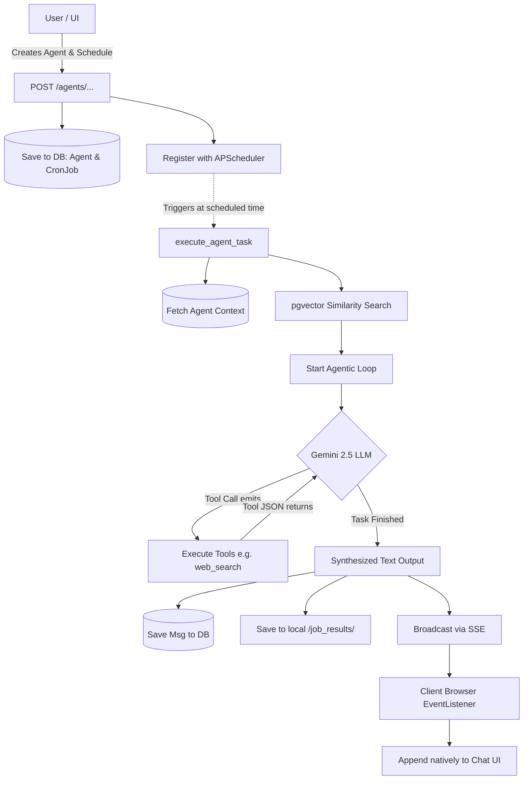

# Cron Job Architecture & Agent Execution Flow

This application uses an advanced scheduling and execution loop to allow AI Agents to run autonomously on a recurring schedule or specific datetime schedule. 

This document explains the technical lifecycle—from the moment you submit a schedule down to how the agent executes and streams the results back to your browser.

## Workflow Overview

---

## 1. Creation and Scheduling (`main.py` & `scheduler_service.py`)

A user can instruct the parent core agent to create a sub-agent on a schedule. This creates an entity in the database and registers its next activation time with **APScheduler**, a background process runner inside the FastAPI backend.

1. **Database Persistence:** The `handle_create_agent_tool` handles the AI's instruction. It saves the agent to the `Agent` table and immediately writes a `CronJob` entry into the database.
2. **Timezone Accuracy:** The schedule string can be a crontab string (`0 10 * * 1-5`) or an ISO-8601 future system-local time.
3. **Memory Registration:** The backend calls `register_job(scheduler, new_job)`, registering the raw Python `execute_agent_task` function into APScheduler under a unique `job_id`, telling it exactly when to fire.

## 2. Wake-up Trigger (`execute_agent_task` in `agent_runner.py`)

When the exact time occurs (e.g., `10:37 AM`), APScheduler physically wakes up the background execution thread.

1. **Context Loading:** `execute_agent_task` fetches the assigned agent from the database, grabbing its internal identity and system prompt ("You are a weather watcher. Check the temperature.")
2. **RAG Injection (Vector Database):** The execution thread automatically searches the `pgvector` database history for previous similar conversations that match the scheduled task description, appending relevant historical data to the prompt.
3. **Execution Block:** The cron job builds a synthesized user prompt stating: *"System Event: Execute the following scheduled task now — <Task>"*.

## 3. The Agentic Loop (`_run_agentic_loop`)

With the context initialized, the thread passes everything into the Google Gemini LLM API, requesting an answer or action.

1. **Function Calling:** If the model realizes it needs external tools (like checking the internet, reading local files, or sending webhooks), it emits a `[tool]` call instead of a text string.
2. **Recursive Execution:** The background Python thread physically runs the tool (e.g., `web_search`), appends the JSON result to the chat history array, and sends it *back* to Gemini.
3. **Final Response:** This loop repeats (max 5 times) until Gemini reaches a conclusion and returns a synthesized final output text string.

## 4. Broadcasting & Storage

Once the LLM returns its final synthesized job block, the backend must save it.

* **Database History:** The content is injected into the `Message` table tagged under the `cron` source identifier. The content is automatically prefixed with `[Job #X]` so it clusters chronologically.
* **Server-Sent Events (SSE):** We instantly broadcast the newly created database entry via asynchronous SSE stream to any connected `index.html` client listening on the `/{user_id}/stream` endpoint.
* **Text Logs:** A secondary `.txt` file backup is written cleanly into `job_results/` on the local file system.

## 5. UI Integration (`index.html`)

When the user is signed into the dashboard, their browser natively listens to the SSE stream.
If an event fires with `type == "cron_result"`, the javascript function reads the JSON payload and automatically injects an HTML block styling it inside their live chat feed—regardless of which AI Agent they are currently interacting with in the app!
